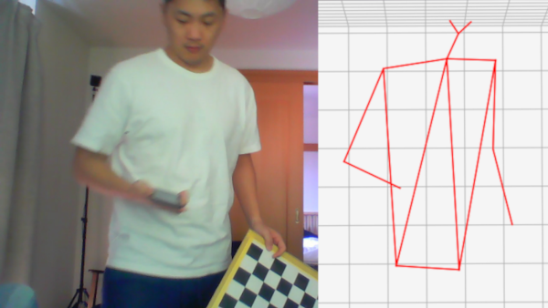

In this post, I show how to calibrate two cameras looking at the same view using a checkerboard pattern. Next, I show how to triangulate a 3D point based on the observed pixels of the two cameras.

The flow of this demo will be:

  1. Calibrate each camera separately using the checkerboard pattern.
  2. Calibrate stereo camera setup.
  3. Use direct linear transform(DLT) to triangulate camera pixels to 3D coordinates.

I assume that you have already taken checkerboard pattern videos by both cameras. Make sure that your cameras are synchronized so that both frames see the same checkerboard pattern at the same time. If you don’t have video available, you can download my calibration frames here: [link](https://drive.google.com/file/d/1yFGQU8PG_Ls6DXDRshWoEydSS29sUJbI/view?usp=sharing). Put each folder in the zip file next to your code script.  

**  1. Calibrating Single View Cameras **

The cameras are first calibrated individually. This is recommended because the number of parameters that need to be fitted are large for the stereo calibration case.

We first read in the calibration frames:
'''python
import cv2 as cv
import glob
import numpy as np
 
images_folder = 'D2/*'
images_names = glob.glob(images_folder)
images = []
for imname in images_names:
    im = cv.imread(imname, 1)
    images.append(im)    

'''
